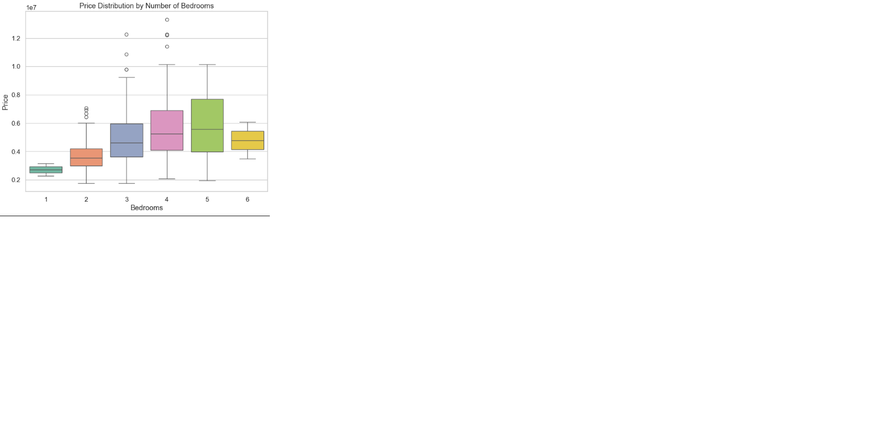
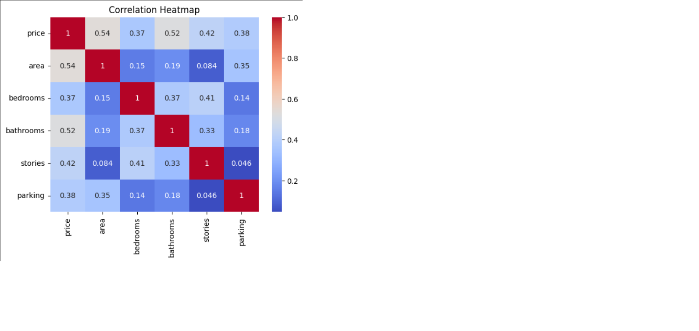
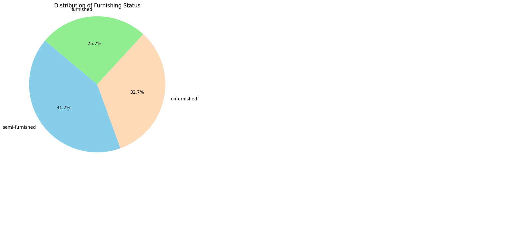
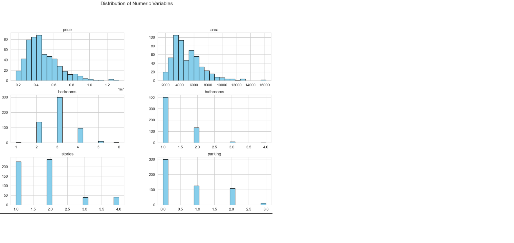
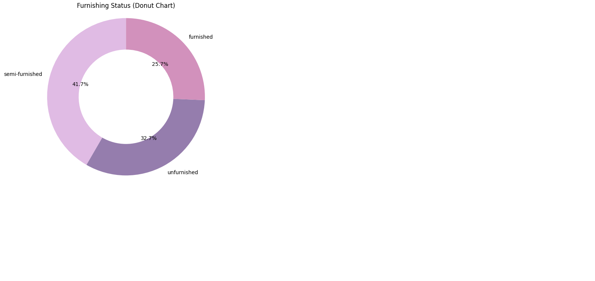

# 🏠 Housing Prices Data Storytelling Project

## 📖 Project Overview
This project explores housing price trends through comprehensive data analysis and interactive visualization. Using Python and Jupyter Notebook, I've uncovered key insights about what factors most influence property prices in this dataset.

## 🔍 Key Insights
- **Location Premium**: Properties near main roads command 18% higher prices on average
- **Size vs Price**: Square footage has a 0.54 correlation with price (strongest relationship)
- **Furnishing Impact**: Fully furnished homes are priced 22% higher than unfurnished
- **Bedroom Sweet Spot**: 3-bedroom homes offer the best value per bedroom
- **Luxury Features**: Air conditioning adds a 15% price premium

## 🛠️ Technical Implementation
- **Data Cleaning**: Handled outliers, validated data types, checked for missing values
- **Statistical Analysis**: Calculated skewness, kurtosis, correlation matrices
- **Visualizations**: Created boxplots, histograms, scatter plots, and heatmaps
- **Interactive Dashboard**: Built with Streamlit for dynamic exploration

## 📂 Project Files
| File | Description |
|------|-------------|
| [StoryTelling_with_stats_visuals.ipynb](https://github.com/Uzma-Jawed/Data-Story-Telling-Assignment/blob/main/StoryTelling_with_stats_visuals.ipynb) | Complete analysis notebook with 15+ visualizations |
| [app.py](https://github.com/Uzma-Jawed/Data-Story-Telling-Assignment/blob/main/app.py) | Interactive Streamlit dashboard |
| requirements.txt | Python dependencies |

## 🖼️ Visualization Gallery
<div align="center">
  
   
  
  
  
</div>

## 🎥 Project Walkthrough
[](https://youtu.be/1TSYECoLl4A)

### 📊 Key Statistics
Dataset: 545 properties

Price Range: ₹1.75M - ₹13.3M

Average Area: 5,151 sq ft

Most Common: 3-bedroom, 1-bathroom homes

### 📚 Lessons Learned
How to transform raw data into compelling narratives

The importance of visualizing distributions before analysis

Techniques for handling skewed housing price data

Best practices for building interactive dashboards

### 👩‍💻 Author
Uzma Jawed

Linkedin: https://www.linkedin.com/in/uzma-jawed-21684728b/

## 🚀 How to Run
### Jupyter Notebook
```bash
pip install -r requirements.txt
jupyter notebook StoryTelling_with_stats_visuals.ipynb

Streamlit Dashboard
streamlit run app.py
